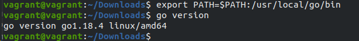
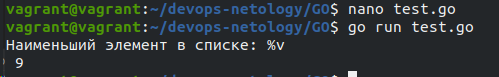
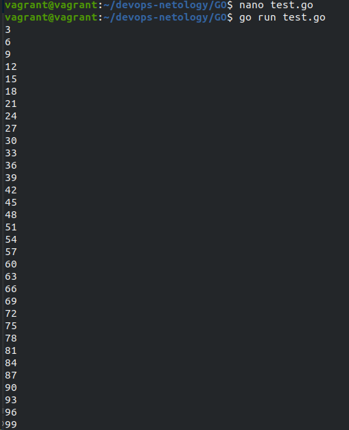

# Домашнее задание к занятию "7.5. Основы golang"

## Задача 1. Установите golang.
Воспользуйтесь инструкций с официального сайта: https://golang.org/.

- **Ответ**



## Задача 2. Знакомство с gotour.
У Golang есть обучающая интерактивная консоль https://tour.golang.org/. Рекомендуется изучить максимальное количество примеров. В консоли уже написан необходимый код, осталось только с ним ознакомиться и поэкспериментировать как написано в инструкции в левой части экрана.
- **Ознакомился**

## Задача 3. Написание кода.
Цель этого задания закрепить знания о базовом синтаксисе языка. Можно использовать редактор кода на своем компьютере, либо использовать песочницу: https://play.golang.org/.

Напишите программу для перевода метров в футы (1 фут = 0.3048 метр). Можно запросить исходные данные у пользователя, а можно статически задать в коде. Для взаимодействия с пользователем можно использовать функцию Scanf:

**Ответ:** В одном метре 3,280839895013123 футов. Поэтому округляем и используем число 3,28
```
package main

import "fmt"

func main() {
    fmt.Print("Введите метры: ")
    var input float64
    fmt.Scanf("%f", &input)

    output := input * 3,28

    fmt.Println(output)    
}
```

Напишите программу, которая найдет наименьший элемент в любом заданном списке, например:

x := []int{48,96,86,68,57,82,63,70,37,34,83,27,19,97,9,17,}

**Ответ:** Использован цикл для перебора списка и вычисления наименьшего элемента.
```
package main

import "fmt"

func main() {
    x := []int{48,96,86,68,57,82,63,70,37,34,83,27,19,97,9,17}

    min := x[0]
    for _, y := range x {
            if (y < min) {
                min = y
            }
    }

    fmt.Println("Наименьший элемент в списке: %v\n", min)
}
```



Напишите программу, которая выводит числа от 1 до 100, которые делятся на 3. То есть (3, 6, 9, …).

```
package main

import "fmt"

func createMassive(x int, y int) []int {
	s := make([]int, y-x+1)
	for i := range s {
		s[i] = i + x
	}
	return s
}

func main() {
	for _, value := range createMassive(1, 100) {
		if value%3 == 0 {
			fmt.Println(value)
		}
	}
}
```


