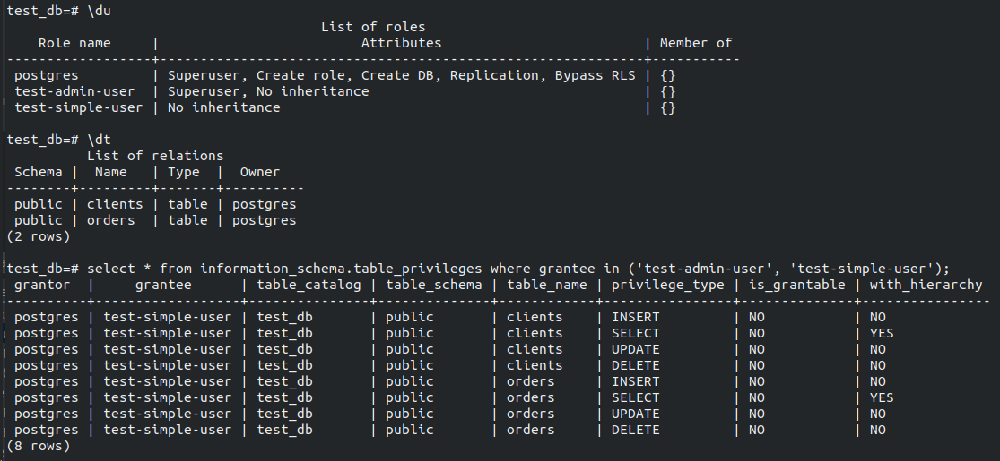
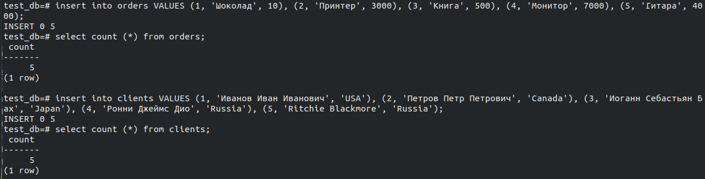
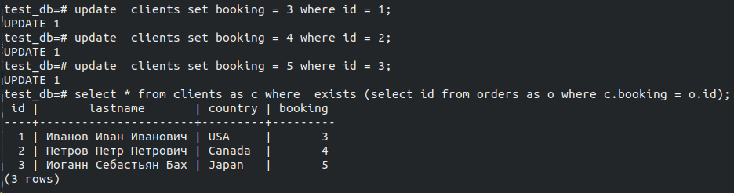
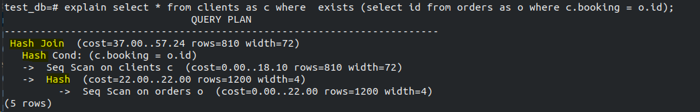

# Домашнее задание к занятию "6.2. SQL"

## Задача 1
Используя docker поднимите инстанс PostgreSQL (версию 12) c 2 volume, в который будут складываться данные БД и бэкапы.
```
vagrant@vagrant:~$ docker pull postgres:12
vagrant@vagrant:~$ docker volume create vol2
vol2
vagrant@vagrant:~$ docker volume create vol1
vol1
vagrant@vagrant:~$ docker run --rm --name pg-docker -e POSTGRES_PASSWORD=postgres -ti -p 5432:5432 -v vol1:/var/lib/postgresql/data -v vol2:/var/lib/postgresql postgres:12
```


## Задача 2
```
CREATE DATABASE test_db;
CREATE ROLE "test-admin-user" SUPERUSER NOCREATEDB NOCREATEROLE NOINHERIT LOGIN;

CREATE TABLE orders 
(
id integer, 
name text, 
price integer, 
PRIMARY KEY (id) 
);

CREATE TABLE clients 
(
	id integer PRIMARY KEY,
	lastname text,
	country text,
	booking integer,
	FOREIGN KEY (booking) REFERENCES orders (Id)
);

CREATE ROLE "test-simple-user" NOSUPERUSER NOCREATEDB NOCREATEROLE NOINHERIT LOGIN;
GRANT SELECT ON TABLE public.clients TO "test-simple-user";
GRANT INSERT ON TABLE public.clients TO "test-simple-user";
GRANT UPDATE ON TABLE public.clients TO "test-simple-user";
GRANT DELETE ON TABLE public.clients TO "test-simple-user";
GRANT SELECT ON TABLE public.orders TO "test-simple-user";
GRANT INSERT ON TABLE public.orders TO "test-simple-user";
GRANT UPDATE ON TABLE public.orders TO "test-simple-user";
GRANT DELETE ON TABLE public.orders TO "test-simple-user";
```





Приведите:

итоговый список БД после выполнения пунктов выше,
описание таблиц (describe)
SQL-запрос для выдачи списка пользователей с правами над таблицами test_db
список пользователей с правами над таблицами test_db

## Задача 3


## Задача 4


## Задача 5


Hash - cost показывает стоимость запроса 
Далее показывает шаги связи, и сбор сканирование таблиц после связи

## Задача 6
Создайте бэкап БД test_db и поместите его в volume, предназначенный для бэкапов (см. Задачу 1).
Остановите контейнер с PostgreSQL (но не удаляйте volumes).
Поднимите новый пустой контейнер с PostgreSQL.
Восстановите БД test_db в новом контейнере.
Приведите список операций, который вы применяли для бэкапа данных и восстановления.