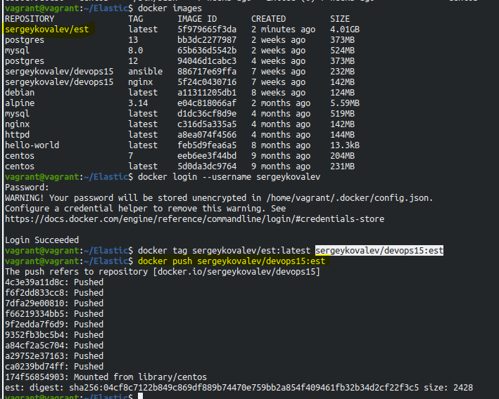

# Домашнее задание к занятию "5.3. Введение. Экосистема. Архитектура. Жизненный цикл Docker контейнера"
## Задача 1

Сценарий выполения задачи:

- создайте свой репозиторий на https://hub.docker.com;
- выберете любой образ, который содержит веб-сервер Nginx;
- создайте свой fork образа;
- реализуйте функциональность: запуск веб-сервера в фоне с индекс-страницей, содержащей HTML-код ниже:

```
<html>
<head>
Hey, Netology
</head>
<body>
<h1>I’m DevOps Engineer!</h1>
</body>
</html>
```
После добавления в Index.html не распознается символ '



## Задача 2

Посмотрите на сценарий ниже и ответьте на вопрос: "Подходит ли в этом сценарии использование Docker контейнеров или лучше подойдет виртуальная машина, физическая машина? Может быть возможны разные варианты?"

Детально опишите и обоснуйте свой выбор.

--

Сценарий:

- Высоконагруженное монолитное java веб-приложение; 
  - физический сервер, раз монолитное, в микросерверах не реализуемо без изменения кода,
    раз  высоконагруженное - то необходим физический доступ к ресурсами.
- Nodejs веб-приложение;
  - это веб приложение, для таких приложений достаточно докера.
- Мобильное приложение c версиями для Android и iOS;
  - Виртаульная машина так как приложение в докере не имеет GUI.
- Шина данных на базе Apache Kafka;
  - для прод контура лучше виртуальная машина, для тестового контура можно обойтись контейнером.
- Elasticsearch кластер для реализации логирования продуктивного веб-приложения - три ноды elasticsearch, два logstash и две ноды kibana;
  - Elasticsearсh лучше развернуть на виртуальной машине, отказоустойчивость решается на уровне кластера, 
    logstash и kibana можно вынести в docker контейнер.
- Мониторинг-стек на базе Prometheus и Grafana;
  - системы мониторинга не хранят данные, можно развернуть в контейнерах,
   из плюсов скорость развертывания, возможность масштабирования для различных задач.
- MongoDB, как основное хранилище данных для java-приложения;
  - тут надо использовать Виртуальную машину, т.к. имеется хранилище данных использование контейнера повышает риск их потерять
  так как БД не высоконагруженная физический сервер на неё будет выделять жирновато)))
- Gitlab сервер для реализации CI/CD процессов и приватный (закрытый) Docker Registry.
  - так же склоняюсь к использованию Виртуальной машин в кластере для сохранения данных и повышению отказоустойчивости.

## Задача 3

- Запустите первый контейнер из образа centos c любым тэгом в фоновом режиме, подключив папку /data из текущей рабочей директории на хостовой машине в /data контейнера;
  - ``` vagrant@vagrant:~/virt_03_docker$ docker container run -v /home/vagrant/virt_03_docker/data:/data --name centos -d centos ```
- Запустите второй контейнер из образа debian в фоновом режиме, подключив папку /data из текущей рабочей директории на хостовой машине в /data контейнера;
  - ``` vagrant@vagrant:~/virt_03_docker/data$ docker run -v /home/vagrant/virt_03_docker/data:/data --name debian -d debian ```
- Подключитесь к первому контейнеру с помощью docker exec и создайте текстовый файл любого содержания в /data;
  - ``` [root@8bb6c79a0c56 /]# cd /data/
    [root@8bb6c79a0c56 data]# ls
    test.txt  test2.txt
    [root@8bb6c79a0c56 data]# ls
    test.txt  test2.txt  test3.txt ```
- Добавьте еще один файл в папку /data на хостовой машине;
  - ``` vagrant@vagrant:~/virt_03_docker/data$ ls
    test2.txt  test3.txt  test.txt ```
- Подключитесь во второй контейнер и отобразите листинг и содержание файлов в /data контейнера.
  - ``` root@e9de0fca74da:/# ls
    bin  boot  data  dev  etc  home  lib  lib64  media  mnt  opt  proc  root  run  sbin  srv  sys  tmp  usr  var
    root@e9de0fca74da:/# cd data/
    root@e9de0fca74da:/data# ls
    test.txt
    root@e9de0fca74da:/data# ls
    test.txt  test2.txt
    root@e9de0fca74da:/data# touch test3.txt
    root@e9de0fca74da:/data# ls
    test.txt  test2.txt  test3.txt ```

## Задача 4 (*)

Воспроизвести практическую часть лекции самостоятельно.

Соберите Docker образ с Ansible, загрузите на Docker Hub и пришлите ссылку вместе с остальными ответами к задачам.

https://hub.docker.com/repository/docker/sergeykovalev/devops15/general
