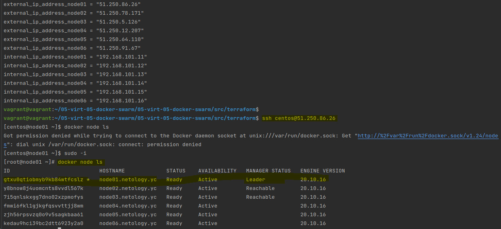
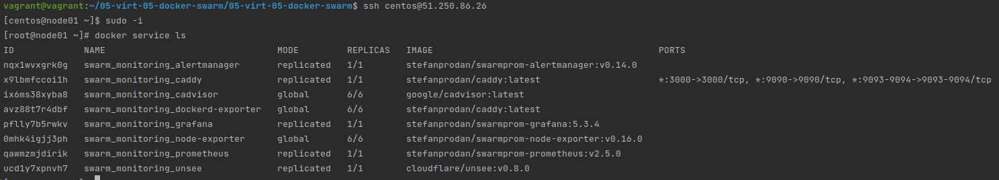
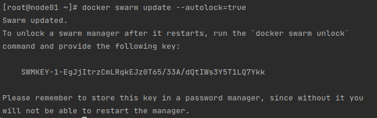

# Домашнее задание к занятию "5.5. Оркестрация кластером Docker контейнеров на примере Docker Swarm"

## Задача 1

Дайте письменые ответы на следующие вопросы:

```
    В чём отличие режимов работы сервисов в Docker Swarm кластере: replication и global?
```
- Существует два типа развертывания сервисов: копирование и глобальное.
   - Replicated services
    Вы можете указать количество выполненных задач. Например, вы решаете развернуть три копии экземпляров HTTP, каждый из которых предоставляет один и тот же контент.
   - Global services
    Запустите одну и ту же задачу на каждом узле. Нет необходимости указывать количество заданий заранее. Каждый раз, когда узел добавляется в рой, координатор создает задачу, а планировщик назначает задачу новому узлу.
```
    Какой алгоритм выбора лидера используется в Docker Swarm кластере?
```
- используется так называемый алгоритм поддержания распределенного консенсуса — Raft, он заключается в том, чтобы убедиться, что все узлы менеджера, отвечающие за управление и планирование задач в кластере, сохраняют одно и то же согласованное состояние.
Наличие одинакового согласованного состояния в кластере означает, что в случае сбоя любой узел диспетчера может взять на себя задачи и восстановить службы в стабильном состоянии. 
  - Например, если руководитель-менеджер , отвечающий за планирование задач в кластере, неожиданно умирает, любой другой менеджер может взять на себя задачу планирования и повторной балансировки задач для соответствия желаемому состоянию.
Системы, использующие алгоритмы консенсуса для репликации журналов в распределенных системах, требуют особой осторожности. Они гарантируют, что состояние кластера остается согласованным при наличии сбоев, требуя, чтобы большинство узлов согласовывали значения.
Raft допускает (N-1)/2сбои и требует, чтобы большинство или кворум (N/2)+1членов согласились на значения, предлагаемые кластеру. Это означает, что в кластере из 5 менеджеров под управлением Raft, если 3 узла недоступны, система не может больше обрабатывать запросы на планирование дополнительных задач. Существующие задачи продолжают выполняться, но планировщик не может перебалансировать задачи, чтобы справляться со сбоями, если набор диспетчера неисправен.
```
    Что такое Overlay Network?
```
- Overlay-сеть использует технологию vxlan, которая инкапсулирует layer 2 фреймы в layer 4 пакеты (UDP/IP). При помощи этого действия Docker создает виртуальные сети поверх существующих связей между хостами, которые могут оказаться внутри одной подсети. Любые точки, которые являются частью этой виртуальной сети, выглядят друг для друга так, будто они связаны поверх свича и не заботятся об устройстве основной физической сети.

## Задача 2

Создать ваш первый Docker Swarm кластер в Яндекс.Облаке

Для получения зачета, вам необходимо предоставить скриншот из терминала (консоли), с выводом команды:
```
docker node ls
```

## Задача 3

Создать ваш первый, готовый к боевой эксплуатации кластер мониторинга, состоящий из стека микросервисов.

Для получения зачета, вам необходимо предоставить скриншот из терминала (консоли), с выводом команды:
```
docker service ls
```


## Задача 4 (*)

Выполнить на лидере Docker Swarm кластера команду (указанную ниже) и дать письменное описание её функционала, что она делает и зачем она нужна:

см.документацию: https://docs.docker.com/engine/swarm/swarm_manager_locking/
```
docker swarm update --autolock=true
```


Журналы Raft, используемые менеджерами swarm, по умолчанию шифруются на диске. Это шифрование в защищает конфигурацию и данные службы от злоумышленников, которые получают доступ к зашифрованным журналам Raft. Одной из причин появления этой функции была поддержка функции Docker secrets.

При перезапуске Docker в память каждого узла диспетчера загружаются как ключ TLS, используемый для шифрования связи между узлами swarm, так и ключ, используемый для шифрования и дешифрования журналов Raft на диске. Docker может защитить взаимный ключ шифрования TLS и ключ, используемый для шифрования и дешифрования журналов Raft, позволяя вам владеть этими ключами и требовать ручной разблокировки ваших менеджеров. Эта функция называется autolock.

При перезапуске Docker сначала необходимо разблокировать рой, используя ключ шифрования, сгенерированный Docker, когда рой был заблокирован.
Чтобы включить автоблокировку существующего роя, необходимо установить autolock=true.
Чтобы отключить автоблокировку, установить --autolock=false