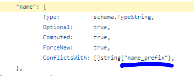

# Домашнее задание к занятию "7.6. Написание собственных провайдеров для Terraform."
Бывает, что

- общедоступная документация по терраформ ресурсам не всегда достоверна,
- в документации не хватает каких-нибудь правил валидации или неточно описаны параметры,
- понадобиться использовать провайдер без официальной документации,
- может возникнуть необходимость написать свой провайдер для системы используемой в ваших проектах.

## Задача 1.
Давайте потренируемся читать исходный код AWS провайдера, который можно склонировать от сюда: https://github.com/hashicorp/terraform-provider-aws.git. Просто найдите нужные ресурсы в исходном коде и ответы на вопросы станут понятны.

Найдите, где перечислены все доступные resource и data_source, приложите ссылку на эти строки в коде на гитхабе.

**Ответ:** По последним коммитам нашел вот эти данные:

- [resourse](https://github.com/hashicorp/terraform-provider-aws/blob/8ed579596823be7604461c75ad564c83bf3b6c69/internal/provider/provider.go#L754)
- [data_source](https://github.com/hashicorp/terraform-provider-aws/blob/8ed579596823be7604461c75ad564c83bf3b6c69/internal/provider/provider.go#L346)

Для создания очереди сообщений SQS используется ресурс aws_sqs_queue у которого есть параметр name.
- С каким другим параметром конфликтует name? Приложите строчку кода, в которой это указано.
- Какая максимальная длина имени?
- Какому регулярному выражению должно подчиняться имя?

**Ответ:**
- Параметр **name** конфликтует с параметром **name_prefix**



- Максимальная длина имени **80**
- Регулярное выражение
```
if fifoQueue {
    re = regexp.MustCompile(`^[a-zA-Z0-9_-]{1,75}\.fifo$`)
} else {
    re = regexp.MustCompile(`^[a-zA-Z0-9_-]{1,80}$`)
}
```