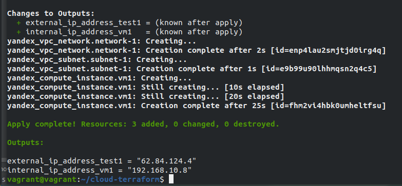

# Домашнее задание к занятию "7.2. Облачные провайдеры и синтаксис Terraform."

## Задача 1 (Вариант с Yandex.Cloud). Регистрация в ЯО и знакомство с основами (необязательно, но крайне желательно).


- Что бы не указывать не указывать авторизационный токен в коде надо воспользоваться командой
```
export YC_TOKEN=`yc iam create-token`
```
## Задача 2. Создание yandex_compute_instance через терраформ.


При помощи какого инструмента (из разобранных на прошлом занятии) можно создать свой образ ami?
- **Ответ** При помощи *Packer*

Ссылку на репозиторий с исходной конфигурацией терраформа.


