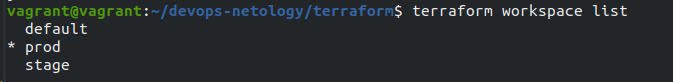
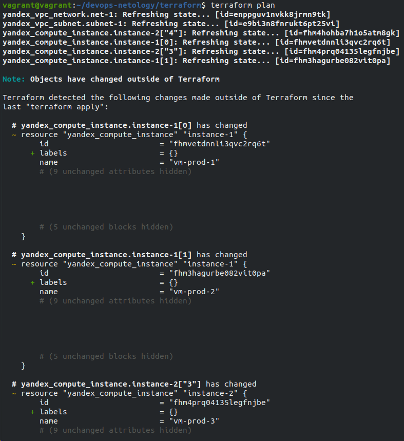
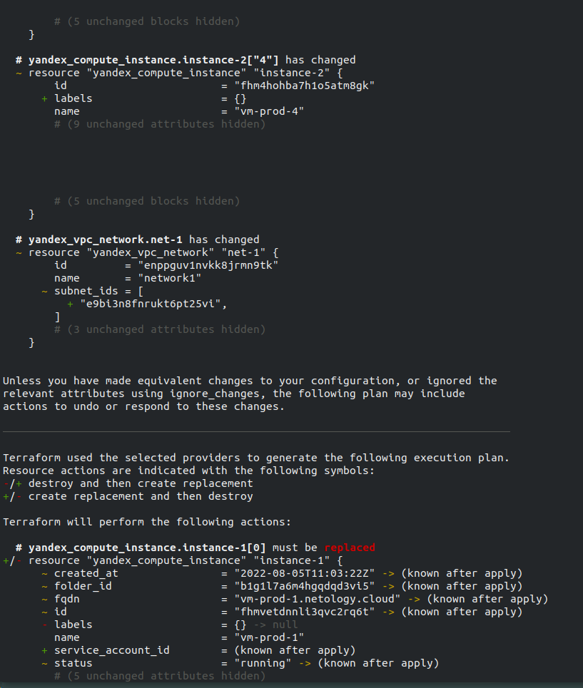
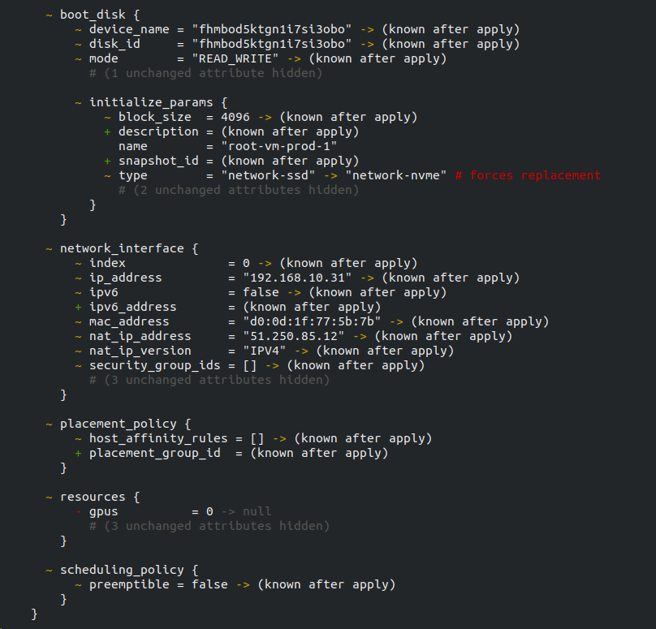
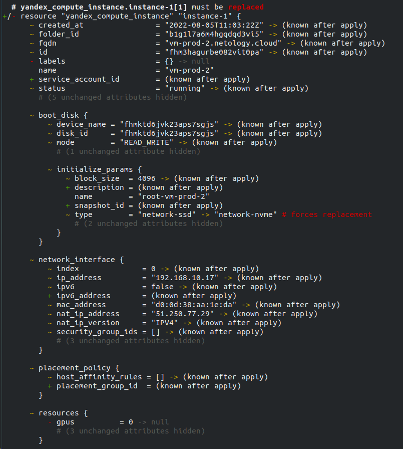
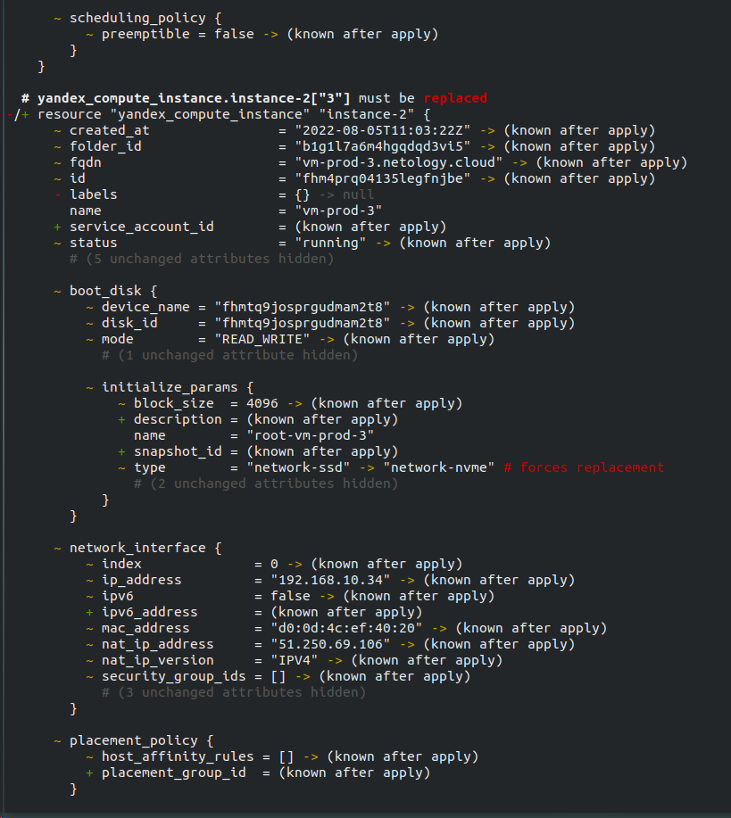
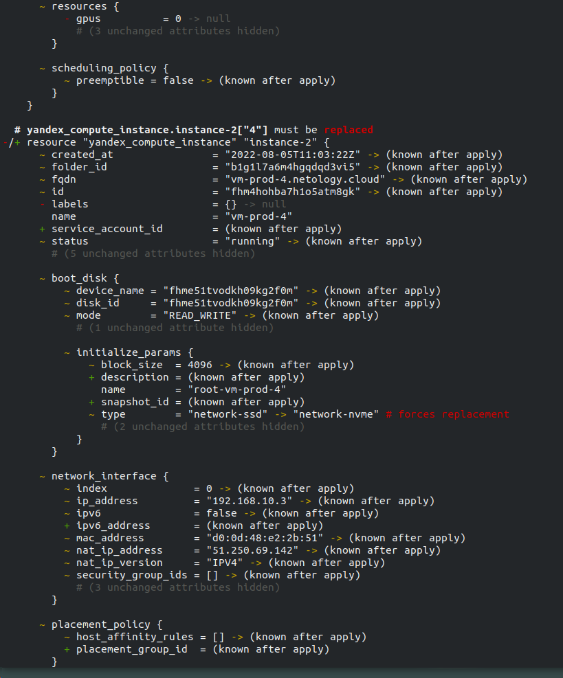
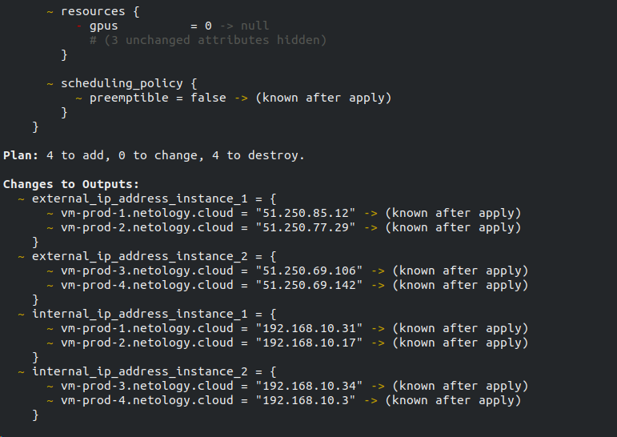
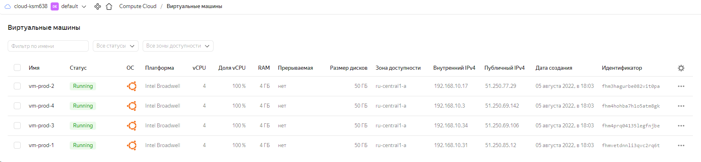

# Домашнее задание к занятию "7.3. Основы и принцип работы Терраформ"

## Задача 1. Создадим бэкэнд в S3 (необязательно, но крайне желательно).
Если в рамках предыдущего задания у вас уже есть аккаунт AWS, то давайте продолжим знакомство со взаимодействием терраформа и aws.

Создайте s3 бакет, iam роль и пользователя от которого будет работать терраформ. Можно создать отдельного пользователя, а можно использовать созданного в рамках предыдущего задания, просто добавьте ему необходимы права, как описано здесь.
Зарегистрируйте бэкэнд в терраформ проекте как описано по ссылке выше.

**Ответ:** С AWS возникли проблемы поэтому делал на облаке яндекс.
Создавал при помощи terraform по документации на https://cloud.yandex.ru/docs/storage/operations/buckets/create

## Задача 2. Инициализируем проект и создаем воркспейсы.
В виде результата работы пришлите:

Вывод команды terraform workspace list.

- 

Вывод команды terraform plan для воркспейса prod.
- 
- 
- 
- 
- 
- 
- 

- 
