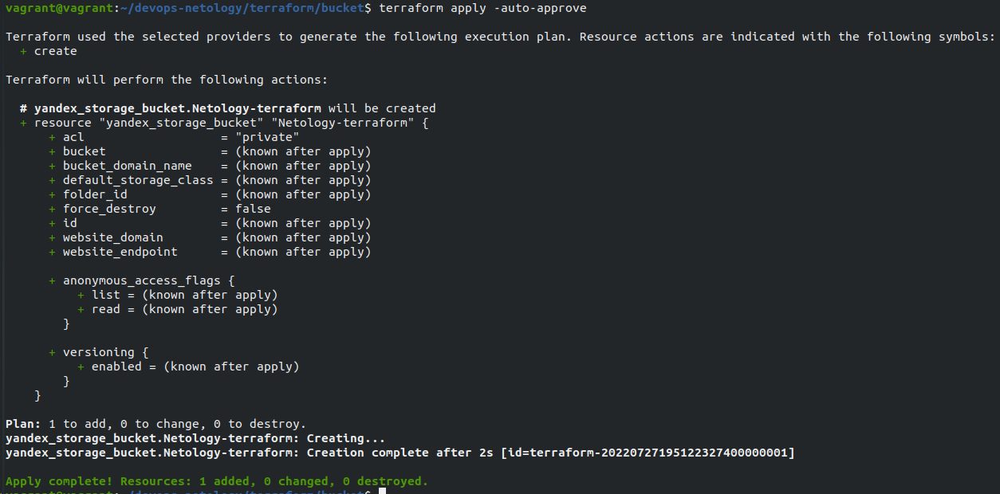
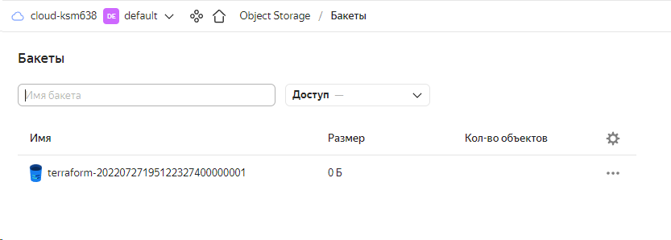

# Домашнее задание к занятию "7.3. Основы и принцип работы Терраформ"

## Задача 1. Создадим бэкэнд в S3 (необязательно, но крайне желательно).
Если в рамках предыдущего задания у вас уже есть аккаунт AWS, то давайте продолжим знакомство со взаимодействием терраформа и aws.

Создайте s3 бакет, iam роль и пользователя от которого будет работать терраформ. Можно создать отдельного пользователя, а можно использовать созданного в рамках предыдущего задания, просто добавьте ему необходимы права, как описано здесь.
Зарегистрируйте бэкэнд в терраформ проекте как описано по ссылке выше.

**Ответ:** С AWS возникли проблемы поэтому делал на облаке яндекс.
Создавал при помощи terraform по документации на https://cloud.yandex.ru/docs/storage/operations/buckets/create

## Задача 2. Инициализируем проект и создаем воркспейсы.
Выполните terraform init:
если был создан бэкэнд в S3, то терраформ создат файл стейтов в S3 и запись в таблице dynamodb.
иначе будет создан локальный файл со стейтами.
Создайте два воркспейса stage и prod.
В уже созданный aws_instance добавьте зависимость типа инстанса от вокспейса, что бы в разных ворскспейсах использовались разные instance_type.
Добавим count. Для stage должен создаться один экземпляр ec2, а для prod два.
Создайте рядом еще один aws_instance, но теперь определите их количество при помощи for_each, а не count.
Что бы при изменении типа инстанса не возникло ситуации, когда не будет ни одного инстанса добавьте параметр жизненного цикла create_before_destroy = true в один из рессурсов aws_instance.
При желании поэкспериментируйте с другими параметрами и рессурсами.
В виде результата работы пришлите:

Вывод команды terraform workspace list.
Вывод команды terraform plan для воркспейса prod.